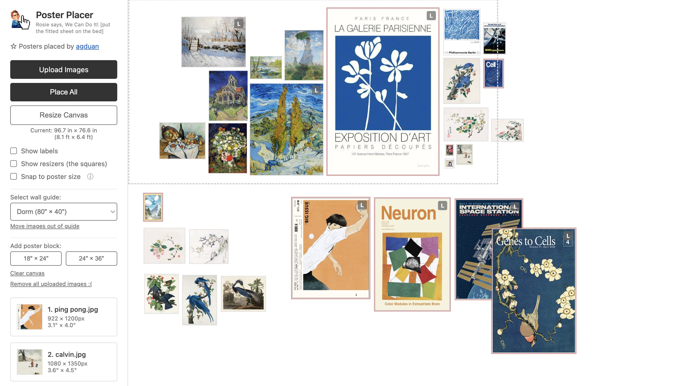

# Poster Placer

This is a web app for planning poster arrangements on your wall. All changes are saved locally, hopefully.

*The default layout of the [website](agduan.github.io/poster-placer). Wait a few seconds for the site to load.*

**Why make this instead of using Photoshop?** The site (1) calculates all images' maximum poster sizes and displays them relative to each other, (2) visually indicates if you've expanded an image beyond its max size, (3) lets you snap all images to standard poster sizes, and (4) includes a dorm wall rectangle guide.

## How to Use

1. **Add images.** Click any image in the sidebar to place it on the canvas, or click "Upload Images" to add your own.
2. **Move images.** Click and drag to reposition.
    Selecting multiple images is enabled! Check "Show labels" and "Show resizers" to see dimensions and resize unselected images.
3. **Resize images.** Drag the corner handles to resize.

Delete images using backspace. Undo using `Ctrl+Z`/`Cmd+Z`.

### Additional Features
- *Red border:* Appears when an image is resized beyond its original dimensions (would lose quality if printed). Click the "MAX" button on its label to reset.
- *"L" marker:* Indicates images larger than letter paper (8.5" × 11").
- *Multi-select:* Hold `Shift` + click or drag on the canvas. Selected images move together.

**Other Options**
- *Place All:* Auto-places all unplaced sidebar, in order of maximum size.
- *Snap to poster size:* Snaps images to standard print sizes (4×6 up to 24×36). Unchecking reverts to original sizes.
- *Select wall guide:* Shows a dotted line reference overlay for a typical dorm wall's empty space.
- *Move images out of guide:* Move all images below the guide area.
- *Clear canvas / Remove uploaded:* Reset stuff.
- *Add poster block:* Creates a placeholder rectangle for the selected size.

## Technical Details

Built with HTML, CSS, and JavaScript.

The `posters.json` file stores preloaded images. Uploaded images are stored in LocalStorage. If running locally, add new image files to the `Posters/` folder and filenames to `posters.json`. 

## FAQ

**Q:** Why is the standard layout so ugly?  
**A:** If I had the artistic sense to pick nice posters, I probably wouldn't have needed to make this.

**Q:** Can you really not put on a fitted sheet?  
**A:** Okay fitted sheets are fine but the one that goes on the blanket is genuinely really hard to get back on